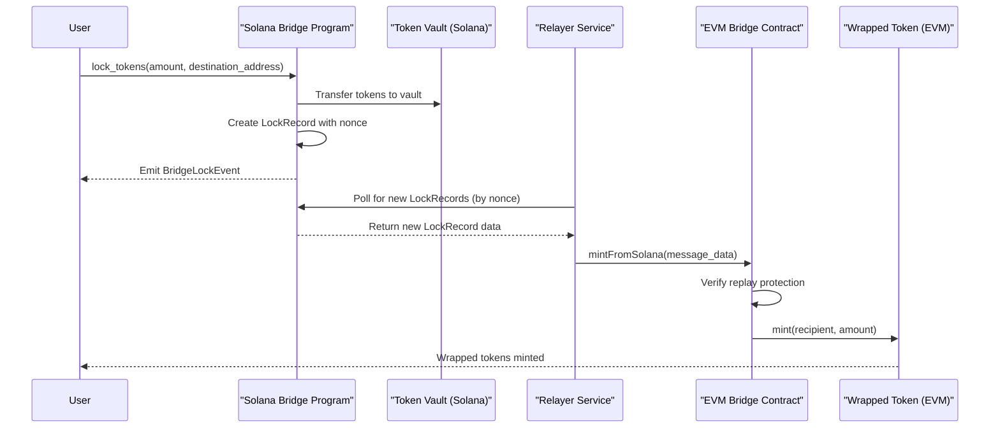
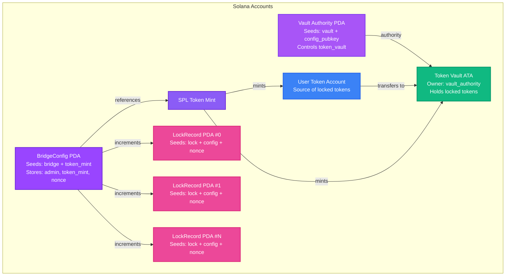
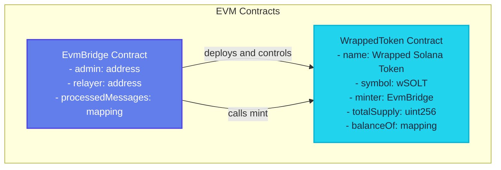

# Solana ↔ EVM Bridge

A cross-chain bridge enabling token transfers from Solana to EVM-compatible chains (e.g., Ethereum, Base, Arbitrum).

## Overview

This bridge allows users to lock tokens on Solana and receive wrapped tokens on EVM chains. The system consists of three main components:

1. **Solana Program** - Handles token locking on Solana
2. **EVM Bridge Contract** - Mints wrapped tokens on EVM chains
3. **Relayer Service** - Monitors Solana events and relays messages to EVM

## Architecture

### Overall Flow

> **Note:** Mermaid diagrams render automatically on GitHub. For local preview, use a markdown viewer with Mermaid support (e.g., VS Code with Mermaid extension, or view on GitHub).



### Solana Account Model



#### Solana Account Details

**BridgeConfig (PDA)**
- **Seeds**: `["bridge", token_mint]`
- **Fields**:
  - `admin: Pubkey` - Admin wallet address
  - `token_mint: Pubkey` - SPL Token mint address
  - `vault_authority_bump: u8` - Bump seed for vault authority PDA
  - `nonce: u64` - Global nonce counter for lock records
  - `destination_chain_id: u64` - Target EVM chain ID
  - `destination_bridge: [u8; 20]` - EVM bridge contract address
  - `relayer_pubkey: Pubkey` - Relayer wallet on Solana

**Token Vault (Associated Token Account)**
- **Authority**: Vault Authority PDA (seeds: `["vault", config_pubkey]`)
- **Purpose**: Holds all locked tokens from users

**LockRecord (PDA)**
- **Seeds**: `["lock", config_pubkey, nonce.to_le_bytes()]`
- **Fields**:
  - `config: Pubkey` - Reference to BridgeConfig
  - `nonce: u64` - Sequential nonce
  - `user: Pubkey` - User who locked tokens
  - `amount: u64` - Amount locked
  - `destination_address: [u8; 20]` - EVM recipient address
  - `created_at_slot: u64` - Solana slot when locked

### EVM Contract Model



#### EVM Contract Details

**EvmBridge Contract**
- **Admin**: Can update relayer address
- **Relayer**: Only address that can call `mintFromSolana`
- **Replay Protection**: `processedMessages` mapping prevents duplicate message processing
- **Message ID**: `keccak256(srcChainId, config, nonce)`

**WrappedToken Contract**
- **Name**: "Wrapped Solana Token"
- **Symbol**: "wSOLT"
- **Decimals**: 18
- **Minter**: EvmBridge contract (only minter can mint)
- **Standard**: ERC-20 compatible

### Data Flow

```mermaid
graph LR
    subgraph "Solana Chain"
        A["User locks 100 tokens"]
        B["Tokens moved to Vault"]
        C["LockRecord created with nonce N"]
        D["Event emitted"]
    end

    subgraph "Relayer"
        E["Poll Solana for new nonces"]
        F["Read LockRecord PDA"]
        G["Build bridge message"]
        H["Sign transaction"]
    end

    subgraph "EVM Chain"
        I["mintFromSolana called"]
        J["Replay check passed"]
        K["WrappedToken.mint"]
        L["100 wSOLT to user"]
    end

    A --> B --> C --> D
    D -.->|monitored| E
    E --> F --> G --> H
    H -->|transaction| I
    I --> J --> K --> L

    style A fill:#9945FF,stroke:#6D28D9,stroke-width:2px,color:#fff
    style B fill:#A855F7,stroke:#7C3AED,stroke-width:2px,color:#fff
    style C fill:#EC4899,stroke:#DB2777,stroke-width:2px,color:#fff
    style D fill:#10B981,stroke:#059669,stroke-width:2px,color:#fff
    style E fill:#F59E0B,stroke:#D97706,stroke-width:2px,color:#fff
    style F fill:#F97316,stroke:#EA580C,stroke-width:2px,color:#fff
    style G fill:#FB923C,stroke:#F97316,stroke-width:2px,color:#fff
    style H fill:#FDBA74,stroke:#FB923C,stroke-width:2px,color:#1e293b
    style I fill:#627EEA,stroke:#4F46E5,stroke-width:2px,color:#fff
    style J fill:#818CF8,stroke:#6366F1,stroke-width:2px,color:#fff
    style K fill:#22D3EE,stroke:#06B6D4,stroke-width:2px,color:#1e293b
    style L fill:#34D399,stroke:#10B981,stroke-width:2px,color:#1e293b
```



## Components

### 1. Solana Program (`bridging-solana/`)

**Program ID**: `F5qk3bMoRNyZao5RciKt7X5BN44wg93p6ExE5qwSi4Ww`

**Instructions**:
- `initialize` - Initializes bridge configuration for a token
- `lock_tokens` - Locks tokens and creates a lock record

**Key Features**:
- Uses PDAs (Program Derived Addresses) for deterministic account generation
- Nonce-based ordering ensures no gaps in lock records
- Event emission for off-chain monitoring
- Vault authority controlled by PDA (no single point of failure)

**Technology Stack**:
- Anchor framework
- Rust
- SPL Token program

### 2. EVM Bridge Contract (`evm-bridge/`)

**Key Features**:
- Replay protection via message ID tracking
- Admin-controlled relayer updates
- Automatic wrapped token deployment
- Event emission for monitoring

**Functions**:
- `mintFromSolana` - Relayer-only function to mint wrapped tokens
- `setRelayer` - Admin-only function to update relayer address

**Technology Stack**:
- Solidity ^0.8.13
- Foundry for development and testing

### 3. Relayer Service (`relayer/`)

**Functionality**:
- Monitors Solana bridge config for new nonces
- Fetches LockRecord PDAs for each new nonce
- Builds bridge messages with all required data
- Submits transactions to EVM bridge contract

**Key Features**:
- Nonce-based processing ensures order
- Error handling and retry logic
- Configurable polling interval (10 seconds default)

**Technology Stack**:
- Rust
- Anchor client libraries
- Ethers.rs for EVM interaction
- Solana RPC client

## Security Features

### Solana Side
- ✅ PDA-based vault authority (cannot be controlled by a single key)
- ✅ Nonce-based ordering prevents message reordering
- ✅ Anchor framework provides type safety and account validation
- ✅ Configurable relayer address

### EVM Side
- ✅ Replay protection via message ID mapping
- ✅ Relayer-only minting function
- ✅ Admin-controlled relayer updates
- ✅ Zero address checks

### Relayer
- ⚠️ Currently stores last processed nonce in memory (should persist in production)
- ⚠️ No signature verification yet (should verify Solana signatures in production)

## Current Implementation Status

### ✅ Completed
- [x] Solana program with initialize and lock_tokens instructions
- [x] EVM bridge contract with mintFromSolana function
- [x] Wrapped token contract (ERC-20 compatible)
- [x] Relayer service with nonce-based polling
- [x] Deployment scripts for both chains
- [x] Basic event emission and monitoring

### 🚧 In Progress / TODO
- [ ] Reverse bridge (EVM → Solana)
- [ ] Signature verification in relayer
- [ ] Persistent nonce storage for relayer
- [ ] Error recovery and retry mechanisms
- [ ] Comprehensive testing suite
- [ ] Gas optimization
- [ ] Security audits
- [ ] Multi-chain support configuration
- [ ] Rate limiting and spam protection
- [ ] Admin emergency pause functionality

## Project Structure

```
bridge/
├── bridging-solana/          # Solana Anchor program
│   ├── programs/
│   │   └── bridging-solana/
│   │       ├── src/
│   │       │   ├── lib.rs           # Main program entry
│   │       │   ├── state.rs         # Account state structures
│   │       │   ├── instructions/
│   │       │   │   ├── initialize.rs
│   │       │   │   └── lock_tokens.rs
│   │       │   └── errors.rs
│   └── tests/                # Anchor tests
│
├── evm-bridge/               # EVM smart contracts
│   ├── src/
│   │   └── EvmBridge.sol     # Main bridge contract + WrappedToken
│   ├── script/
│   │   └── Deploy.s.sol      # Deployment script
│   └── test/                 # Foundry tests
│
└── relayer/                  # Rust relayer service
    ├── src/
    │   ├── main.rs           # Main relayer logic
    │   └── abis/             # EVM contract ABIs
    └── idls/                 # Solana program IDLs
```

## Getting Started

### Prerequisites
- Rust and Cargo
- Solana CLI and Anchor
- Foundry (for EVM contracts)
- Node.js and npm/yarn (for tests)

### Setup

See individual README files in each directory:
- `bridging-solana/` - Solana program setup
- `evm-bridge/` - EVM contract setup
- `relayer/` - Relayer service setup

## Environment Variables

### Relayer
- `SOLANA_RPC_URL` - Solana RPC endpoint
- `BRIDGE_CONFIG_PUBKEY` - BridgeConfig PDA address
- `SRC_CHAIN_ID` - Source chain ID (Solana)
- `EVM_RPC_URL` - EVM chain RPC endpoint
- `EVM_PRIVATE_KEY` - Relayer wallet private key
- `EVM_CHAIN_ID` - Destination EVM chain ID
- `EVM_BRIDGE_ADDRESS` - Deployed EvmBridge contract address

## Message Format

The bridge message structure passed from Solana to EVM:

```rust
struct BridgeMessage {
    src_chain_id: u64,           // Source chain (Solana) ID
    config: [u8; 32],            // BridgeConfig PDA pubkey
    nonce: u64,                  // Sequential nonce
    token_mint: [u8; 32],        // Solana token mint address
    user: [u8; 32],              // Solana user pubkey
    amount: u64,                 // Locked amount
    destination_address: [u8; 20] // EVM recipient address
}
```

## License

UNLICENSED

