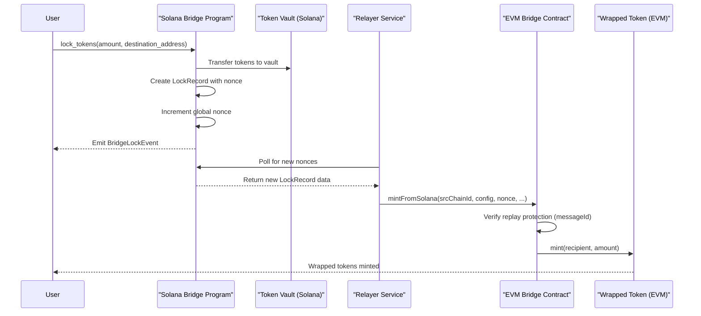
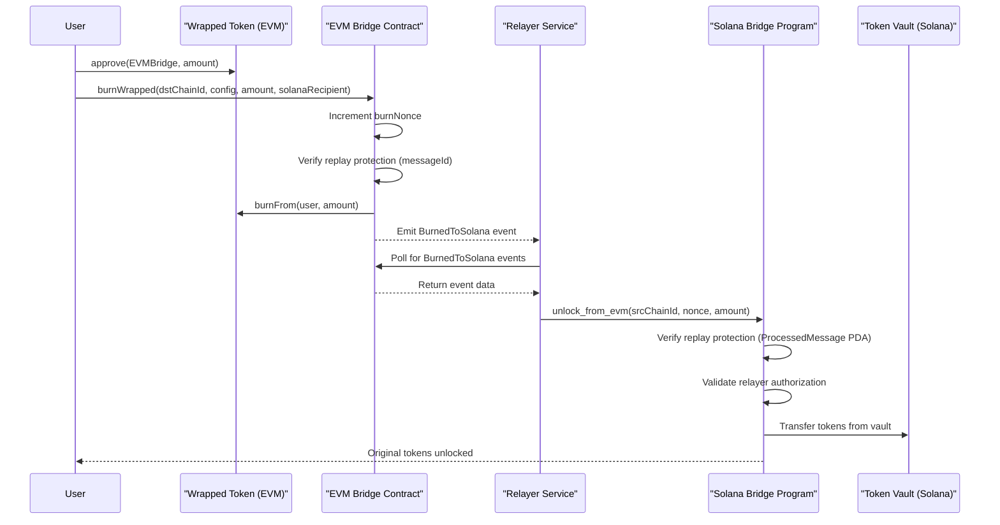
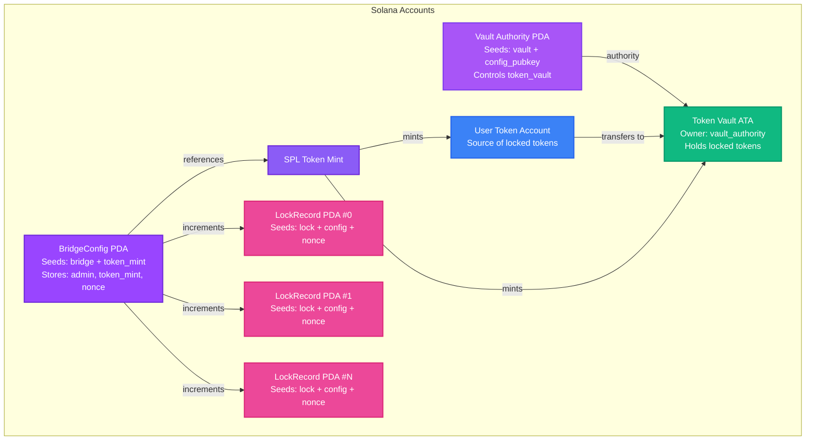
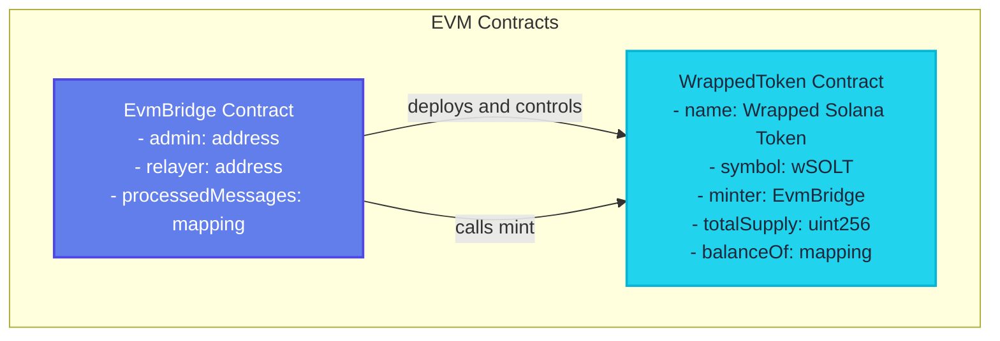

# Solana ↔ EVM Bridge

A bidirectional bridge that lets you move tokens between Solana and EVM chains (like Ethereum, Base, Arbitrum). Lock tokens on Solana, get wrapped tokens on EVM. Burn wrapped tokens on EVM, unlock the originals back on Solana.

## What This Does

Think of it like a two-way token bridge:
- **Solana → EVM**: Lock your tokens on Solana, get equivalent wrapped tokens on EVM
- **EVM → Solana**: Burn wrapped tokens on EVM, unlock the original tokens from the Solana vault

The whole system has three parts:
1. **Solana Program** - Where users lock/unlock tokens. Uses PDAs (Solana's deterministic addresses) for security.
2. **EVM Bridge Contract** - Handles minting/burning wrapped tokens. Has admin controls for emergency situations.
3. **Relayer** - Off-chain service that watches both chains and forwards transactions. Written in Rust.

## Architecture

### Overall Flow (Bidirectional)

> **Note:** Mermaid diagrams render automatically on GitHub. For local preview, use a markdown viewer with Mermaid support (e.g., VS Code with Mermaid extension, or view on GitHub).

#### Solana → EVM Flow (Lock & Mint)



#### EVM → Solana Flow (Burn & Unlock)



### Solana Account Model



#### Solana Account Details

**BridgeConfig (PDA)** - The main config account stored on Solana
- **How it's found**: PDA with seeds `["bridge", token_mint]` - deterministic, can't be guessed
- **What it stores**:
  - `admin` - Who can pause the bridge or change settings
  - `token_mint` - Which SPL token this bridge handles
  - `nonce` - Counter that goes up each time someone locks tokens (prevents replay attacks)
  - `destination_bridge` - The EVM contract address (20 bytes)
  - `relayer_pubkey` - Which wallet is allowed to call unlock_from_evm
  - `paused` - Emergency stop switch

**Token Vault** - Where all locked tokens live
- It's an Associated Token Account owned by a PDA (not a regular wallet)
- When you lock tokens, they go here. When unlocking from EVM, tokens come from here.

**LockRecord (PDA)** - One record per lock operation
- **How it's found**: PDA with seeds `["lock", config_pubkey, nonce]`
- **What it stores**:
  - Which user locked tokens
  - How much they locked
  - Where on EVM they want the wrapped tokens sent (destination_address)
  - The nonce at time of lock

**ProcessedMessage (PDA)** - Prevents double-unlocking
- When the relayer unlocks tokens from an EVM burn, we create this PDA
- Seeds: `["processed", src_chain_id, nonce]` - unique per unlock attempt
- Stops the same burn event from being processed twice

### EVM Contract Model



#### EVM Contract Details

**EvmBridge Contract** - The main bridge contract on EVM

Who can do what:
- **Admin**: Can change admin, update relayer, pause everything
- **Relayer**: Only one allowed to call `mintFromSolana` (when tokens come from Solana)
- **Anyone**: Can call `burnWrapped` to send tokens back to Solana

Security:
- Uses `processedMessages` mapping to prevent replay attacks
  - Each message gets a unique ID based on `keccak256(chainId, config, nonce, ...)`
  - Once processed, that ID is marked and can't be used again
- Has a `burnNonce` that auto-increments (with overflow check)
- Can be paused by admin for emergencies

**Main Functions**:
- `mintFromSolana(...)` - Only relayer can call this. Mints wrapped tokens when user locks on Solana.
- `burnWrapped(...)` - Anyone can call. Burns wrapped tokens and emits event for relayer to see.
- `pause()` / `unpause()` - Admin only. Emergency stop.
- `setAdmin()` / `setRelayer()` - Admin only. Update who's in charge.

**WrappedToken** - Standard ERC-20 token
- Full ERC-20 implementation (transfer, approve, etc.)
- Only the EvmBridge contract can mint new tokens
- When you burn, tokens are destroyed and an unlock happens on Solana

### Data Flow

```mermaid
graph LR
    subgraph "Solana Chain"
        A["User locks 100 tokens"]
        B["Tokens moved to Vault"]
        C["LockRecord created with nonce N"]
        D["Event emitted"]
    end

    subgraph "Relayer"
        E["Poll Solana for new nonces"]
        F["Read LockRecord PDA"]
        G["Build bridge message"]
        H["Sign transaction"]
    end

    subgraph "EVM Chain"
        I["mintFromSolana called"]
        J["Replay check passed"]
        K["WrappedToken.mint"]
        L["100 wSOLT to user"]
    end

    A --> B --> C --> D
    D -.->|monitored| E
    E --> F --> G --> H
    H -->|transaction| I
    I --> J --> K --> L

    style A fill:#9945FF,stroke:#6D28D9,stroke-width:2px,color:#fff
    style B fill:#A855F7,stroke:#7C3AED,stroke-width:2px,color:#fff
    style C fill:#EC4899,stroke:#DB2777,stroke-width:2px,color:#fff
    style D fill:#10B981,stroke:#059669,stroke-width:2px,color:#fff
    style E fill:#F59E0B,stroke:#D97706,stroke-width:2px,color:#fff
    style F fill:#F97316,stroke:#EA580C,stroke-width:2px,color:#fff
    style G fill:#FB923C,stroke:#F97316,stroke-width:2px,color:#fff
    style H fill:#FDBA74,stroke:#FB923C,stroke-width:2px,color:#1e293b
    style I fill:#627EEA,stroke:#4F46E5,stroke-width:2px,color:#fff
    style J fill:#818CF8,stroke:#6366F1,stroke-width:2px,color:#fff
    style K fill:#22D3EE,stroke:#06B6D4,stroke-width:2px,color:#1e293b
    style L fill:#34D399,stroke:#10B981,stroke-width:2px,color:#1e293b
```



## Components

### 1. Solana Program (`bridging-solana/`)

Program ID: `F5qk3bMoRNyZao5RciKt7X5BN44wg93p6ExE5qwSi4Ww`

**What it does**:
- `initialize` - Sets up a new bridge for a specific token (admin only, one-time setup)
- `lock_tokens` - User locks tokens, they go to vault, we create a LockRecord
- `unlock_from_evm` - Relayer calls this when someone burns on EVM. Transfers from vault to user.
- `pause_bridge` / `resume_bridge` - Admin can stop everything if needed

**Why it's secure**:
- Everything uses PDAs - addresses derived deterministically, can't be guessed or controlled by a single key
- Each lock increments a nonce, so we always know the order things happened
- Can't unlock the same burn twice (ProcessedMessage PDA tracks what's been done)
- Vault is controlled by a PDA, not a regular wallet (more secure)

**Tech**: Anchor framework (makes Solana development easier), Rust, SPL Token program

### 2. EVM Bridge Contract (`evm-bridge/`)

**What it does**:
- When tokens come from Solana: relayer calls `mintFromSolana`, we mint wrapped tokens
- When user wants to go back: user calls `burnWrapped`, we burn tokens and emit event
- Deploys the wrapped token automatically in constructor

**Security stuff**:
- Every message has a unique ID - can't process the same one twice
- Admin can pause everything or change who the relayer is
- Nonce has overflow protection (won't break if we hit max uint64)

**Tech**: Solidity 0.8.13, Foundry for testing

### 3. Relayer Service (`relayer/`)

**What it does** - runs two loops simultaneously:

**Loop 1: Solana → EVM**
- Checks Solana config's nonce every 5 seconds
- If nonce increased, finds new LockRecords
- Builds the message and calls `mintFromSolana` on EVM
- If it fails, retries next cycle

**Loop 2: EVM → Solana**
- Listens for `BurnedToSolana` events on EVM
- Validates the data (chain ID matches, config matches, etc.)
- Builds Solana instruction and calls `unlock_from_evm`
- Tracks which block we've seen up to (so we don't miss events)

**Features**:
- Can restart from where it left off (env vars for starting nonce/block)
- Validates everything before submitting (doesn't trust the event data blindly)
- Uses Anchor's generated code so types match exactly
- Handles errors gracefully - if one fails, keeps running the other loop

**Tech**: Rust, Anchor client, ethers.rs for EVM, Solana RPC client

## Security & Safety

### Solana Side
- Vault is a PDA, not a regular wallet key - more secure
- Nonce increments for each lock, so we know the order (prevents replay/reordering)
- Relayer must be authorized to unlock (can't just anyone call unlock_from_evm)
- Can't unlock the same burn twice (ProcessedMessage PDA prevents it)
- Admin can pause if something looks wrong
- Checks for zero addresses (would be bad to send tokens to address(0))

### EVM Side
- Every message gets a unique ID - once processed, can't be processed again
- Only the authorized relayer can mint (Solana → EVM direction)
- Anyone can burn (EVM → Solana), but that's fine - they're burning their own tokens
- Admin can change relayer or pause everything
- Nonce overflow check (won't break at max uint64)
- Standard ERC-20 for wrapped token (battle-tested code)

### Relayer
- Validates chain IDs and configs before submitting (doesn't trust blindly)
- Can restart from last position (env vars remember where we were)
- If one direction fails, other keeps running
- Uses Anchor generated code (types match, less chance of bugs)
- ⚠️ Should verify Solana transaction signatures in production (not done yet)
- ⚠️ Should use a database instead of env vars for state in production

## What's Done vs What's Left

### ✅ Working Now
- Full bidirectional bridge (Solana ↔ EVM)
- All Solana instructions (lock, unlock, pause, resume)
- All EVM functions (mint, burn, admin controls)
- Relayer that monitors both directions
- Replay protection on both sides
- Basic tests for Solana program
- Deployment scripts

### 🚧 Still To Do
- More comprehensive tests (especially Foundry tests for EVM)
- Integration tests (test the full flow end-to-end)
- Production-ready relayer (database instead of env vars, signature verification)
- Security audit (important before mainnet)
- Gas optimization pass
- Multi-chain support (handle multiple EVM chains)
- Rate limiting (prevent spam)
- Monitoring/alerting (know when something breaks)
- CLI tool (easier for users to interact)

## Project Structure

```
bridge/
├── bridging-solana/          # Solana Anchor program
│   ├── programs/
│   │   └── bridging-solana/
│   │       ├── src/
│   │       │   ├── lib.rs           # Main program entry
│   │       │   ├── state.rs         # Account state structures
│   │       │   ├── instructions/
│   │       │   │   ├── mod.rs
│   │       │   │   ├── initialize.rs
│   │       │   │   ├── lock_tokens.rs
│   │       │   │   ├── unlock_from_evm.rs
│   │       │   │   ├── pause_bridge.rs
│   │       │   │   └── resume_bridge.rs
│   │       │   └── errors.rs
│   └── tests/                # Anchor tests
│       ├── initialize.ts
│       ├── lock_tokens.ts
│       ├── unlock_from_evm.ts
│       └── pause_resume.ts
│
├── evm-bridge/               # EVM smart contracts
│   ├── src/
│   │   ├── EvmBridge.sol     # Main bridge contract
│   │   └── WrappedToken.sol  # ERC-20 wrapped token
│   ├── script/
│   │   └── Deploy.s.sol      # Deployment script
│   └── test/                 # Foundry tests
│
└── relayer/                  # Rust relayer service
    ├── src/
    │   ├── main.rs           # Main entry point (runs both loops)
    │   ├── loops/
    │   │   ├── solana_to_eth.rs  # Solana → EVM monitoring
    │   │   └── eth_to_solana.rs  # EVM → Solana monitoring
    │   └── abis/             # EVM contract ABIs
    ├── idls/                 # Solana program IDLs
    └── Cargo.toml
```

## Getting Started

### Prerequisites
- Rust and Cargo
- Solana CLI and Anchor
- Foundry (for EVM contracts)
- Node.js and npm/yarn (for tests)

### Setup

See individual README files in each directory:
- `bridging-solana/` - Solana program setup
- `evm-bridge/` - EVM contract setup
- `relayer/` - Relayer service setup

## Environment Variables

### Relayer Configuration

**Required for Solana → EVM Loop:**
- `SOLANA_RPC_URL` - Solana RPC endpoint (e.g., `http://localhost:8899`)
- `BRIDGE_CONFIG_PUBKEY` - BridgeConfig PDA address
- `SRC_CHAIN_ID` - Source chain ID (Solana chain ID, e.g., `1`)
- `EVM_RPC_URL` - EVM chain RPC endpoint (e.g., `http://localhost:8545`)
- `EVM_PRIVATE_KEY` - EVM relayer wallet private key (without `0x` prefix)
- `EVM_CHAIN_ID` - Destination EVM chain ID (e.g., `31337` for local)
- `EVM_BRIDGE_ADDRESS` - Deployed EvmBridge contract address

**Required for EVM → Solana Loop:**
- `SOLANA_RPC_URL` - Solana RPC endpoint
- `SOLANA_RELAYER_KEYPAIR` - Path to Solana relayer keypair file (e.g., `~/.config/solana/relayer-keypair.json`)
- `BRIDGE_CONFIG_PUBKEY` - BridgeConfig PDA address
- `SOLANA_CHAIN_ID` - Solana chain ID for validation (e.g., `1`)
- `EVM_RPC_URL` - EVM chain RPC endpoint
- `EVM_BRIDGE_ADDRESS` - Deployed EvmBridge contract address

**Optional (for state persistence):**
- `SOLANA_START_NONCE` - Starting nonce for Solana → EVM processing (default: `0`)
- `EVM_START_BLOCK` - Starting block number for EVM → Solana processing (default: current block - 100)

## How Messages Work

### Solana → EVM (Lock & Mint)

When someone locks tokens on Solana:
1. LockRecord gets created with a nonce
2. Relayer sees the nonce increased, reads the LockRecord
3. Relayer calls EVM with this data:
   - Source chain ID (Solana's ID)
   - Config pubkey (which bridge config)
   - Nonce (which lock this was)
   - Token mint, user, amount
   - **destination_address** - where on EVM to mint the wrapped tokens

**Replay protection**: Message ID = `keccak256(srcChainId, config, nonce)`. Same nonce can't be processed twice.

### EVM → Solana (Burn & Unlock)

When someone burns wrapped tokens on EVM:
1. They call `burnWrapped(dstChainId, config, amount, solanaRecipient)`
2. Contract increments `burnNonce` and emits `BurnedToSolana` event
3. Relayer sees the event, validates everything
4. Relayer calls Solana `unlock_from_evm(srcChainId, nonce, amount)`
5. Solana transfers from vault to the recipient

**Replay protection**: ProcessedMessage PDA with seeds `["processed", srcChainId, nonce]`. Can't unlock the same nonce twice.

## Testing & Running

### Solana Tests
```bash
cd bridging-solana
anchor test --skip-local-validator
```
Tests cover: initialization, locking tokens, unlocking from EVM, pause/resume.

### Deploy EVM Contract
```bash
cd evm-bridge
export ADMIN_PRIVATE_KEY="0x..."
export RELAYER_ADDRESS="0x..."
forge script script/Deploy.s.sol:DeployScript \
  --rpc-url http://localhost:8545 \
  --broadcast \
  --private-key $ADMIN_PRIVATE_KEY
```

### Run Relayer
```bash
cd relayer
# Set env vars (see below)
cargo run
```
Both loops run at the same time, checking every 5 seconds.

## License

UNLICENSED

